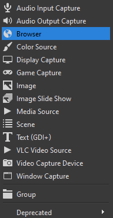
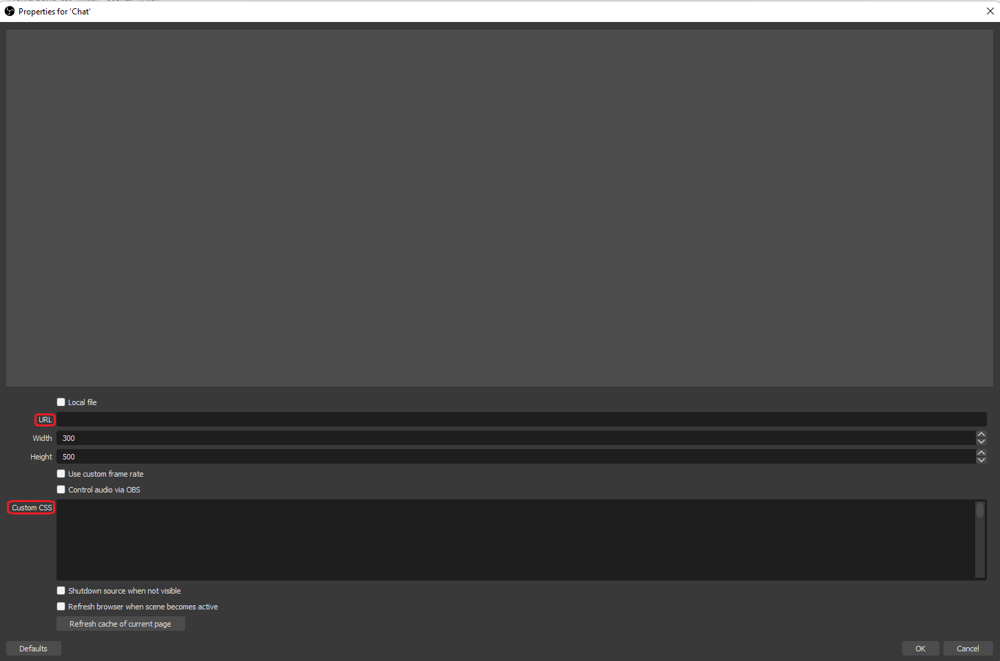
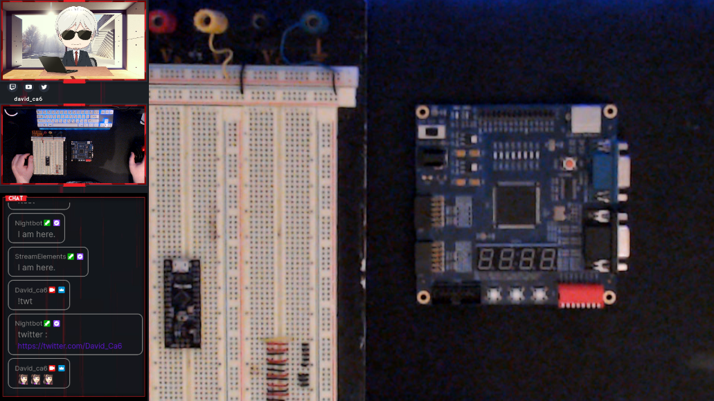
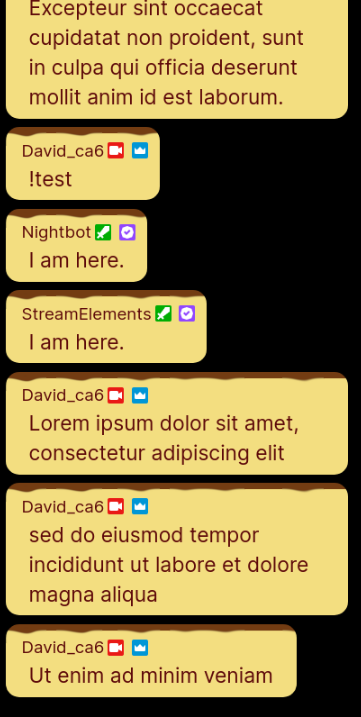
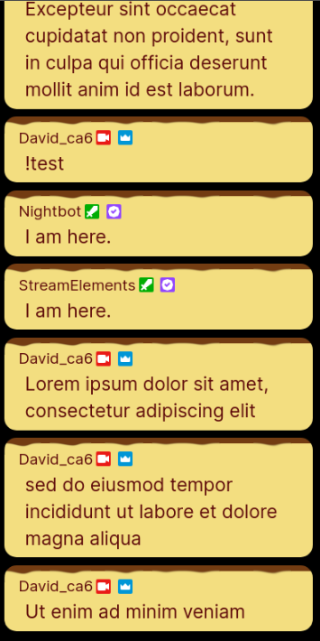
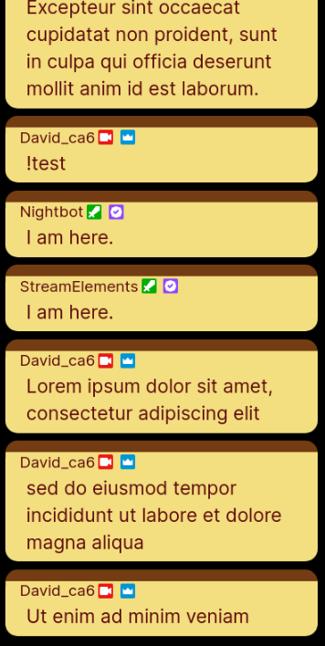
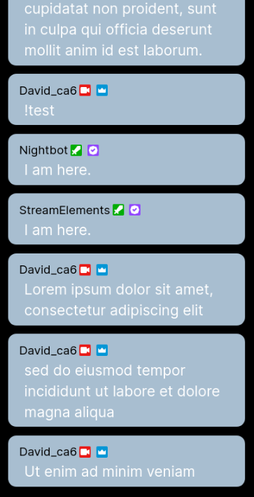

# chatbox_ttv  
Simple CSS Chatbox for twitch.tv   
Please read the MIT license included in this repo   
THE FILES ARE PROVIDED "AS IS", WITHOUT WARRANTY OF ANY KIND.  
  
## How to Use
1. Add a browser source in OBS  
(If you reuse a existing browser source you may need to refresh the cache of the page)   
   
2. Set the URL to your popout chat https://www.twitch.tv/popout/username/chat in the URL field   
3. Remplace the content of the Custom CSS field by the content of ttv.css   
  
4. Set Width and Height   
5. Done
  

## How to Customise   
 TODO   

## Theme

### Purin Themed Chatbox   

  

### Purin Themed Chatbox    

  
  
### Blue Chatbox  

  
   
### Green Chatbox   
 TODO   
 
### Pink Chatbox   
 TODO   
